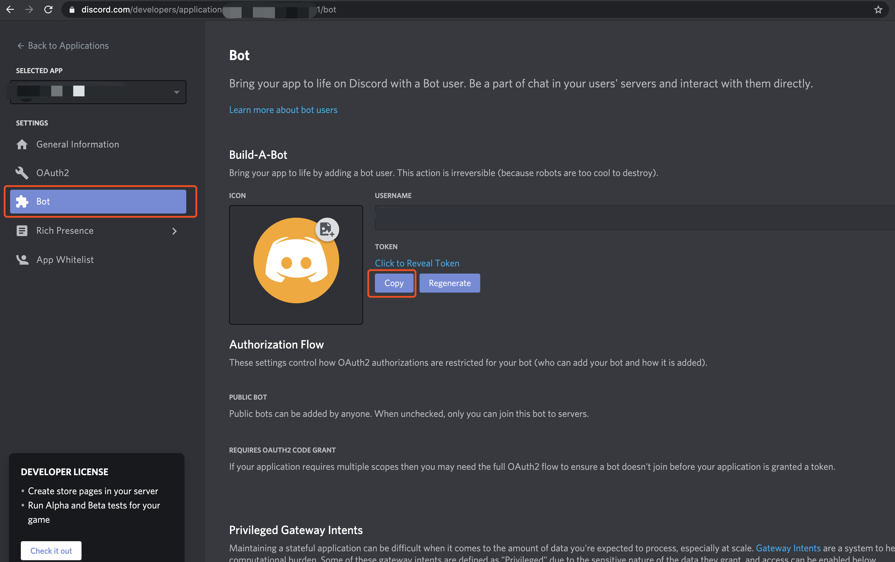

[toc]

## 介绍
本项目为一个discord的机器人。目前还相当简陋。仅能勉强运行。

该机器人目前提供以下业务功能：
* 获取channel的所有历史消息
* 根据用户提供的关键字过滤历史消息
* 通过读取csv文本，批量向用户发送消息

## 项目目录
```
discord_bot                  
├── business                    #存放业务需要的文件
│   ├── batch.csv               #群发的用户及内容
│   └── keywords.csv            #过滤文本所需的关键词
├── config                      #配置文件目录
│   ├── config.yml              #配置文件
│   └── token.txt               #机器人token
├── sql                         #初始化sql
│   ├── analysis.sql            #根据关键词过滤得到的聊天记录
│   ├── history.sql             #聊天记录
│   └── history_time_index.sql  #创建索引的文件
├── commands.py                 #主程序
├── README.md                   
├── bot.db                      #sqlite数据库
├── requirements.txt            #项目依赖
├── end_bot.sh                  #机器人结束脚本
└── start_bot.sh                #机器人运行脚本
```

## 项目依赖
* python 3.8.5+ (理论上只要是python3就可以)
* discord.py

## 如何运行本项目
1.首先在 [discord开发者中心](https://discord.com/developers/applications) 创建一个机器人，并将该机器人添加到你的discord服务器中。请给予机器人administrator权限。

2.在discord开发者中心，Bot栏下复制token，并贴到discord_bot/config/token.txt中。


3.在discord_bot/script目录下执行以下命令
```bash
#pip也有可能是pip3，请根据情况自行变更。国内安装失败请尝试更换pip源为阿里云或者清华的源
pip install -r requirements.txt
#赋予两个脚本执行权限
chmod +x start_bot.sh
chmod +x end_bot.sh
#开始启动机器人
./start.bot.sh
```

4.看到`机器人启动完毕`则机器人完成启动。可在discord服务器中看到机器人已经上线。

## 如何结束机器人
```bash
discord_bot/script/end_bot.sh
```

## 机器人支持命令
机器人的功能运行依靠在discord给机器人下达指令完成。如与机器人发送命令`>service_info`，可获取到服务器的各个channel的id。


目前机器人支持以下命令:

#### >collect_history  
>收集指定channel的所有历史消息。
指定渠道配置在config/config.yml的 history.collect_channel_ids项中。该选项中只能配置TextChannel类型的channel_id

#### >service_info
>可以获取到服务器所有channel的id，名称，以及channel类型。

#### >show_user_info
>可以获取到当前与机器人对话者的user_id，昵称

#### >show_bot_info
>可以获取机器人的的user_id，昵称

#### >bsm
>batch_send_msg的缩写，根据business/batch.csv的内容进行消息群发。
每隔发送一定数量的消息之后会向命令发起者发送当前群发的进度。由于discord限制的消息发送的速度，所以消息执行比较慢。
通知间隔控制配置在config/config.yml的batch_send_msg.progress_tips中。

batch.csv的格式为:

>user_id1|msg1
user_id2|msg2
...

#### >force_stop_bsm
>强制停止当前的群发任务。

#### >analysis
>根据business/keyword.csv文件提供的关键字，对历史消息进行过滤。
每次执行该命令都会自动将之前的分析结果清空。请自行保存。

keyword.csv的文件格式为：

>keyword1
keyword2
keyword3
...